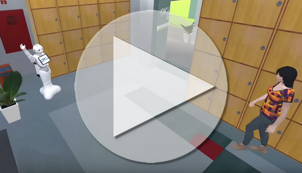
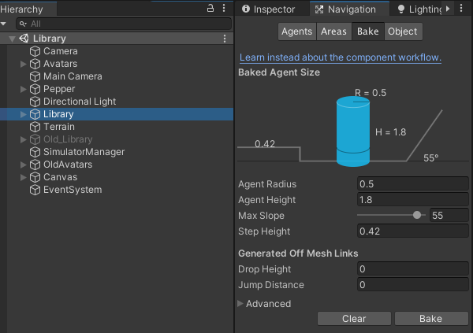
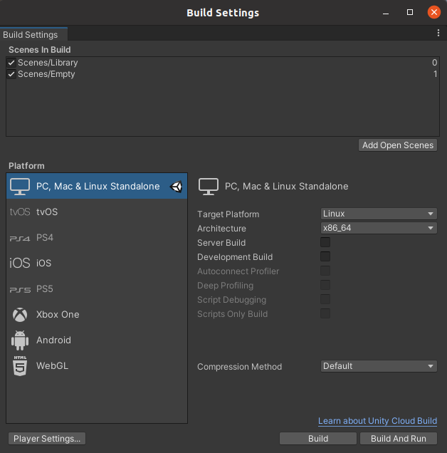

# SimDRLSR: Deep Reinforcement Learning Simulator for Social Robotics

[![Contributors][contributors-shield]][contributors-url]
[![Forks][forks-shield]][forks-url]
[![Stargazers][stars-shield]][stars-url]
[![Issues][issues-shield]][issues-url]
[![GNU License][license-shield]][license-url]
[![Scholar][scholar-shield]][scholar-url]


<!-- PROJECT LOGO -->
<br />
<p align="center">
  <a href="https://github.com/JPedroRBelo/simDRLSR">
    
  </a>

  <!-- <h3 align="center">simDRLSR</h3> -->

  <p align="center">
    Simulator for Deep Reinforcement Learning and Social Robotics   
     <!-- <br /><a href="https://github.com/othneildrew/Best-README-Template"><strong>Explore the docs »</strong></a> -->
    <br />
    <br />
    <a href="https://youtu.be/e4C8hK4q8Ug" target="_blank">View Video</a>
    ·
    <a href="https://github.com/JPedroRBelo/simDRLSR/issues">Report Bug</a>
    ·
    <a href="https://github.com/JPedroRBelo/simDRLSR/issues">Request Feature</a>
  </p>
</p>


<!-- TABLE OF CONTENTS -->
<details open="open">
  <summary>Table of Contents</summary>
  <ol>
    <li>
      <a href="#about-the-project">About The Project</a>      
    </li>
    <li>
      <a href="#getting-started">Getting Started</a>
      <ul>
        <li><a href="#prerequisites">Prerequisites</a></li>
        <li><a href="#installation">Installation</a></li>
        <li><a href="#simdrlsr-configuration">SimDRLSR Configuration</a></li> 
        <li><a href="#mdqn-configuration">MDQN Configuration</a></li> 
        <ul>
          <li><a href="simmdqn">simMDQN</a></li>
           <li><a href="pymdqn">pyMDQN</a></li>
        </ul>
        <li><a href="#running-simulator-with-MDQN-pre-treined-model">Running simulator with MDQN pre-treined model</a></li> 
        <li><a href="#training-a-new-model">Training a new model</a></li> 
        <li><a href="#training-with-pymdqn-instead-of-simmdqn">Training with pyMDQN instead of simMDQN</a></li> 
      </ul>
    </li>
    <li><a href="#license">License</a></li>
    <li><a href="#references">References</a></li>
  </ol>
</details>

## About the Project

SimDRLSR is a simulator for social robotics that offers resources for training and validation of reinforcement and deep learning methods.

The first version of the simulator is based on the MDQN algorithm as a reinforcement learning module, available at:

https://github.com/ahq1993/Multimodal-Deep-Q-Network-for-Social-Human-Robot-Interaction

The simDRLSR simulator offers the Pepper robot structure as an agent, which interacts with the environment using four actions:

 - **Wait**: wait, while looking at a random direction of the environment;
 - **Look**: looks at the nearest human, if he is in the robot's field of view;
 - **Wave**: makes the gesture of waving while looking at the nearest human;
 - **Handshake**: performs the handshake gesture to greet the human.


[](https://youtu.be/e4C8hK4q8Ug)


## Getting Started

### Prerequisites

Simulator requirements:
- 
- Unity Linux Build Support (IL2CPP)

MDQN requirements. It is recommended to install the following packages/frameworks using :
- Ubuntu  16.04  LTS  
- LUA  5.2  
- Torch7
- CUDA  10.1.

Alternatively, you can use pyMDQN, a Python 3 version of MDQN:
- Python 3.8 
- Pytorch (version 1.7.1 is recommended)
- (Optionally) Conda 3 

### Installation

1. Cloning repository
 
   Clone the repo without pyMDQN (MDQN with lua, only):
   ```sh
   git clone git@github.com:JPedroRBelo/simDRLSR.git simDRLSR
   ```
   Alternatively, you can clone the repo with python implementation (pyMDQN) of MDQN (also clone Lua version):
   
   ```sh
   git clone --recursive git@github.com:JPedroRBelo/simDRLSR.git simDRLSR
   ```
2. Building simDRLSR:

  - Open the simDRLSR Unity folder with Unity Editor
  - In Editor go to `File>Open Scene>`
    - Choose "Scenes/Library.unity"
  - Verify if NavMesh is configured:
    
    - Go to `Window>AI>Navigation`
    - Select "Libray" on Hierarchy
    - In `Navigation/Bake` tab, click on "Bake" button   
  
     
    
  - In Editor go to `File>Build Settings...`:
    - Scenes in Build, check:
      - [x] "Scenes/Libray"
      - [x] "Scenes/Empty"
    - Platform: PC, Mac & Linux Standalone
      - Target Platform: Linux
      - Architecture: x86_64 
    - Click Build button:
      - set executable name to simDRLSR.x86_64
      - save inside simDRLSR repo folder

    

     

### SimDRLSR Configuration

The `config.xml` file stores the settings for the simulation. The configuration options are:
- **Simulation Quality**:
  - Very Low
  - Low
  - Medium
  - High
  - Very High  
  The default value is "Medium".
- **Frames Per Second (FPS)**: 60
- **Screen Width**: 1024
- **Screen Height**: 768
- **Fullscreen**: True or False (default)
- ‼️ **IP Address**: stores the IP of MDQN module. Default is 172.17.0.3. If are running the MDQN on a docker container, you need to set the container's IP.If you are running MDQN on the same system as the simulator, localhost IP 127.0.0.1 will probably solve the problem).
- ⚠️ **Port**: port that the MDQN module uses for socket communication. Default is 12375.
- **Path Prob Folder**: folder with human avatar probabilities files.
- ⚠️ **Path WorkDir**: directory with MDQN files. Default is `simDRLSR/simMDQN/`. Change to `simDRLSR/pyMDQN`if you need to use pyMDQN.
- ⚠️ **Total Steps**: defines the number of interactions that robot performs at each data collection. Note: set a higher value than set in the MDQN.

Labels:
- ‼️ : fundamental importance, needs to be configured;
- ⚠️ : needs to be configured if the MDQN parameters are modified;

The IP Adress,most likely, will be the only value you should change.

### MDQN configuration

The simulator simDRLSR v0.270 is based on  published in the scientific article in [[1]](#1). We made minor changes to the original code and made it available in the folder called "simMDQN" (LUA/Torch) or at "PyMDQN" repository (Python,Pytorch; recomended). 

#### pyMDQN


The pyMDQN repository can be found at ,

To configure pyMDQN:

- Clone PyMDQN:

```sh
cd simDRLSR
git clone git@github.com:JPedroRBelo/pyMDQN.git pyMDQN
cd pyMDQN
git checkout master
```
- ⚠️ To use pyMDQN it is not necessary to use a docker container, however, we encourage the use of Conda to install modules, such as pytorch, pip, numpy, etc.
- The IP address is seted to localhost IP `127.0.0.1`. You can change this in `environment.py` pyMDQN script.

#### (Optional) simMDQN

To run simMDQN it's necessary set the host IP address:

  - Edit `robot_environment.lua`
  - Change the local variable `host` to the IP address were simDRLSR is running. If you are running in same system, enter the address localhost `127.0.0.1`. If you are using a docker container, you need to check the IP of the host SO.

(Optional) If you prefer to use CPU instead of GPU, you need to configure the following files:

  - Edit `train_ql.lua`and set `local gpu = 0` to use CPU, or `local gpu = 1` to use GPU;
  - Edit `TrainNQL.lua`and set `self.gpu = 0` to use CPU, or 1 to use GPU.

⚠️ The minimum VRAM is approximately 6GiB.

‼️ This code uses unsupported frameworks and libraries for newer systems. Therefore, it is recommended to use a docker container to run simMDQN.

‼️ Even using Docker, you will have to make several configurations in the system and ensure that the container has access to the simMDQN directory, in addition to configuring write and read permissions.

As the configuration of MDQN with lua has some problems we are developing a version in Python 3. This version is a submodule available in this repository available in pyMDQN.


### Running simulator with MDQN pre-treined model

At v0.1 of simDRLS, we treined the simMDQN over 28000 interactions (14 eps., 2000 steps each ep.). To test the simulator with pretreined MDQM, folow this steps: 

1. To run the simulator, you need to execute:

  ```sh
  cd simDRLSR
  ./simDRLSR.x86_64
  ```
2. To run simMDQN:
  - Open a new terminal, or enter on a docker container
  - Execute:
  ```sh
  cd simDRLSR/simMDQN
  th validate.lua
  ```
The simulator is a socket server, and MDQN is a client. Thus, it is necessary to run the simulator first.
The robot will execut 2000 steps, trying to interact with human throught the four legal actions _wait_, _look_, _wave_ and _handshake_.

At this point, we validate the simDRLSR only with simMDQN.Therefore, we do not provide a model for pyMDQN.

### Training a new model

1. Run the simulator, as described above: 

  ```sh
  cd simDRLSR
  ./simDRLSR.x86_64
  ```
2. On a new terminal, or docker container:
 
 ⚠️ Make sure to back up your trained models before performing the next actions..
 
 - Erasing old train files and images: 
 
   ```sh
   cd simDRLSR/simMDQN
   rm -rf dataset/RGB/ep*
   rm -rf dataset/Depth/ep*
   ``` 
 
 - Initializing files and models:
 
   ```sh
   th makefiles.lua
   th init_model.lua
   ```
 
 - Run the main script:
   ```sh
   th main_train.lua
   ```
  
 The `main_train.lua` script will call the `datageneration_ql.lua` followed by `train_ql.lua` over N eps (N = 14 in original configuration).
 This is all you need to do to run the simulator together with MDQN!
 
 ### Training with pyMDQN instead of simMDQN
 
 1. Run the simulator, as described above: 

  ```sh
  cd simDRLSR
  ./simDRLSR.x86_64
  ```
2. On a new terminal:
 
  ⚠️ Make sure to back up your trained models before performing the next steps.
  
  ⚠️ Remmember to config. WorkDir of simDRLSR with pyMDQN directory!
 
 - Erasing old train files and images: 
 
   ```sh
   cd simDRLSR/pyMDQN
   rm -rf dataset/RGB/ep*
   rm -rf dataset/Depth/ep*
   ``` 
 - If you are using Conda environment:
 
   ```sh
   conda activate pytorch_env
   ```
 - Initializing files and models:
 
     ```sh
     python3 makefiles.py
     python3 init_model.py
     ```
 
 - Run the main script:
     ```sh
     python mdqn.py
     ```
## License

Distributed under the MGNU GPL 3.0. See `LICENSE` for more information.
 
 
## References

<a id="1">[1]</a> 
Ahmed Hussain Qureshi, Yutaka Nakamura, Yuichiro Yoshikawa and Hiroshi Ishiguro 
"Robot gains social intelligence through Multimodal Deep Reinforcement Learning" 
Proceedings of IEEE-RAS International Conference on Humanoid Robots (Humanoids) 
pp. 745-751, Cancun, Mexico 2016.


  
  


<!-- MARKDOWN LINKS & IMAGES -->
<!-- https://www.markdownguide.org/basic-syntax/#reference-style-links -->
[contributors-shield]: https://img.shields.io/github/contributors/JPedroRBelo/simDRLSR.svg?style=for-the-badge
[contributors-url]: https://github.com/JPedroRBelo/simDRLSR/graphs/contributors
[forks-shield]: https://img.shields.io/github/forks/JPedroRBelo/simDRLSR.svg?style=for-the-badge
[forks-url]: https://github.com/JPedroRBelo/simDRLSR/network/members
[stars-shield]: https://img.shields.io/github/stars/JPedroRBelo/simDRLSR.svg?style=for-the-badge
[stars-url]: https://github.com/JPedroRBelo/simDRLSR/stargazers
[issues-shield]: https://img.shields.io/github/issues/JPedroRBelo/simDRLSR.svg?style=for-the-badge
[issues-url]: https://github.com/JPedroRBelo/simDRLSR/issues
[license-shield]: https://img.shields.io/badge/license-GNU%20GPU%203.0-brightgreen?style=for-the-badge
[license-url]: https://github.com/JPedroRBelo/simDRLSR/blob/development/LICENSE
[scholar-shield]: https://img.shields.io/badge/-Google%20Scholar-black.svg?style=for-the-badge&logo=google-scholar&colorB=555
[scholar-url]: https://scholar.google.com.br/citations?user=0nh0sDMAAAAJ&hl

