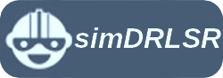

# simDRLSR: Deep Reinforcement Learning Simulator for Social Robotics

[![Contributors][contributors-shield]][contributors-url]
[![Forks][forks-shield]][forks-url]
[![Stargazers][stars-shield]][stars-url]
[![Issues][issues-shield]][issues-url]
[![MIT License][license-shield]][license-url]
[![Scholar][scholar-shield]][scholar-url]

<!-- PROJECT LOGO -->
 

  

  <h3 align="center">Best-README-Template</h3>

  

    An awesome README template to jumpstart your projects!
     
    <a href="https://github.com/othneildrew/Best-README-Template"><strong>Explore the docs »</strong></a>
     
     
    <a href="https://github.com/othneildrew/Best-README-Template">View Demo</a>
    ·
    <a href="https://github.com/othneildrew/Best-README-Template/issues">Report Bug</a>
    ·
    <a href="https://github.com/othneildrew/Best-README-Template/issues">Request Feature</a>
  

<!-- TABLE OF CONTENTS -->

  
Table of Contents

  <ol>
    <li>
      <a href="#about-the-project">About The Project</a>
      <ul>
        <li><a href="#built-with">Built With</a></li>
      </ul>
    </li>
    <li>
      <a href="#getting-started">Getting Started</a>
      <ul>
        <li><a href="#prerequisites">Prerequisites</a></li>
        <li><a href="#installation">Installation</a></li>
      </ul>
    </li>
    <li><a href="#usage">Usage</a></li>
    <li><a href="#roadmap">Roadmap</a></li>
    <li><a href="#contributing">Contributing</a></li>
    <li><a href="#license">License</a></li>
    <li><a href="#contact">Contact</a></li>
    <li><a href="#acknowledgements">Acknowledgements</a></li>
  </ol>

SimDRLSR is a simulator for social robotics that offers resources for training and validation of reinforcement and deep learning methods.

The first version of the simulator is based on the MDQN algorithm as a reinforcement learning module, available at:

https://github.com/ahq1993/Multimodal-Deep-Q-Network-for-Social-Human-Robot-Interaction

The simDRLSR simulator offers the Pepper robot structure as an agent, which interacts with the environment using four actions:

 - wait: wait, while looking at a random direction of the environment;
 - look: looks at the nearest human, if he is in the robot's field of view;
 - wave: makes the gesture of waving while looking at the nearest human;
 - handshake: performs the handshake gesture to greet the human.

<!-- MARKDOWN LINKS & IMAGES -->
<!-- https://www.markdownguide.org/basic-syntax/#reference-style-links -->
[contributors-shield]: https://img.shields.io/github/contributors/JPedroRBelo/simDRLSR.svg?style=for-the-badge
[contributors-url]: https://github.com/JPedroRBelo/simDRLSR/graphs/contributors
[forks-shield]: https://img.shields.io/github/forks/JPedroRBelo/simDRLSR.svg?style=for-the-badge
[forks-url]: https://github.com/JPedroRBelo/simDRLSR/network/members
[stars-shield]: https://img.shields.io/github/stars/JPedroRBelo/simDRLSR.svg?style=for-the-badge
[stars-url]: https://github.com/JPedroRBelo/simDRLSR/stargazers
[issues-shield]: https://img.shields.io/github/issues/JPedroRBelo/simDRLSR.svg?style=for-the-badge
[issues-url]: https://github.com/JPedroRBelo/simDRLSR/issues
[license-shield]: https://img.shields.io/badge/license-GNU%20GPU%203.0-brightgreen?style=for-the-badge
[license-url]: https://github.com/JPedroRBelo/simDRLSR/blob/development/LICENSE
[sholar-shield]: https://img.shields.io/badge/-Google%20Scholar-9cf.svg?style=for-the-badge&logo=google-scholar
[scholar-url]: https://scholar.google.com.br/citations?user=0nh0sDMAAAAJ&hl

